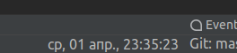

### LocalTimePlugin
This is a plugin for Intellij IDEA that shows local time in StatusBar.    
By default, the plugin shows the day of the week, date and time:    
    
But you can change the view by selecting it in popup menu:    
    
